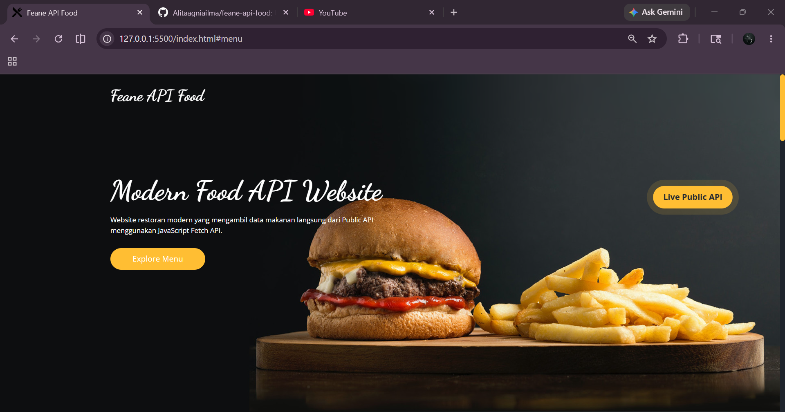
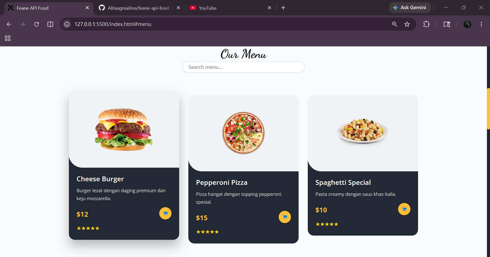

# Feane API Food

Website restoran modern yang dibuat menggunakan HTML, CSS, JavaScript, dan Public REST API.

Project ini dibuat untuk memenuhi tugas Praktikum Pemrograman Web 2 tentang implementasi Public API menggunakan Fetch API JavaScript.

---

## Biodata Mahasiswa

* Nama : Alita Agnia Ilma
* NIM : 2306700022
* Kelas : TI6A

---

## Fitur Website

* Menampilkan data makanan dari Public API
* Fetch API JavaScript
* Search menu realtime
* Responsive design
* Modern UI
* Error handling menggunakan Try-Catch
* Loading animation
* Hover animation card makanan

---

## Tools Yang Digunakan

* HTML5
* CSS3
* Bootstrap
* JavaScript
* Fetch API
* Public REST API

---

## Tampilan Website

  
  

---

## Video Demo

Link Demo Video:

---

## Repository GitHub

GitHub Repository:
https://github.com/Alitaagniailma/feane-api-food
